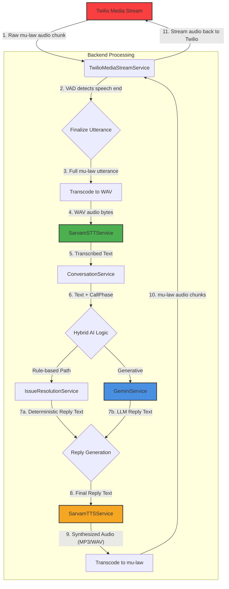

# BOBCards Voice Assistant: Conversation and Data Flow

This document describes the end-to-end flow of a voice call, from initiation to completion, detailing the state transitions and the interaction between different services.

## 1. High-Level Call Flow

The application is designed around a real-time, streaming architecture using Twilio Media Streams.

1.  **Call Initiation**: An outbound call is initiated via an API request, or an inbound call is received by a Twilio number.
2.  **Webhook to FastAPI**: Twilio sends an HTTP POST request to the `/api/twilio/voice` webhook.
3.  **TwiML Response**: The FastAPI backend responds with TwiML (Twilio Markup Language) containing a `<Connect><Stream>` verb. This instructs Twilio to establish a bidirectional WebSocket connection to the `/api/twilio/media-stream` endpoint.
4.  **WebSocket Connection**: Twilio connects to the backend via WebSocket. The `TwilioMediaStreamService` handles this connection.
5.  **Initial Greeting**: The `ConversationService` generates and streams the initial greeting audio to the user.
6.  **Conversation Loop**: The system enters a real-time loop for the duration of the call:
    -   **Listen**: It continuously receives inbound audio (8-bit mu-law) from the user.
    -   **Detect Speech (VAD)**: A Voice Activity Detection (VAD) algorithm identifies when the user starts and stops speaking.
    -   **Transcribe (STT)**: The captured user utterance (a chunk of audio) is sent to the Sarvam AI STT service for transcription.
    -   **Process Logic**: The transcribed text is processed by the `ConversationService`. This service acts as a state machine, deciding the next action based on the current phase of the call and the user's input.
    -   **Generate Reply (Hybrid AI)**: A reply is generated using a hybrid model. This can be a deterministic, rule-based response (from `issue_guidance.py`) for common issues or a generative response from Google Gemini for more nuanced conversation.
    -   **Synthesize Speech (TTS)**: The text reply is sent to the Sarvam AI TTS service to generate audio.
    -   **Stream Playback**: The generated audio is transcoded to mu-law format and streamed back to the user over the WebSocket.
7.  **Barge-In**: If the user starts speaking while the assistant is playing back a response, the system detects this, cancels the current playback, and immediately processes the user's new utterance.
8.  **Call Termination**: The loop continues until the conversation's goal is met, the user hangs up, an explicit handoff is triggered, or a timeout/error occurs.

---

## 2. Business Logic State Machine (`BusinessState`)

The core conversation logic is managed by a high-level state machine. The `ConversationService` orchestrates transitions between these business phases based on user input and the current context of the call.

1.  **`opening`**
    -   **Trigger**: A new call stream starts.
    -   **Action**: The `ConversationService` calls `build_opening_greeting` to create a personalized compliance-first greeting.
    -   **Mandatory disclosure content**:
        -   AI disclosure (assistant identifies as AI)
        -   Bank identity (BOBCards / BOBCards)
        -   Purpose (credit card application continuation)
        -   Recording notice
    -   **Action**: The greeting is synthesized and played to the user.
    -   **Next Phase**: `consent_check`.

2.  **`consent_check`**
    -   **Trigger**: The opening greeting finishes playing. The user responds.
    -   **Action**: The user's speech is transcribed. The `detect_consent_choice` function analyzes the text to determine if consent is "granted", "callback", "send_link", or "opt_out".
    -   **Logic**:
        -   If "granted", the call proceeds.
        -   If "callback", a callback acknowledgment is prepared and call is closed.
        -   If "send_link", an SMS-link acknowledgment is prepared and call is closed.
        -   If "opt_out", opt-out is recorded and call is closed.
        -   If the response is unclear, `build_consent_reprompt` is used to ask again.
    -   **Next Phase**: Determined by `next_phase_after_consent`. It's either `language_selection` (on consent) or `closing`.

3.  **`language_selection`**
    -   **Trigger**: User grants consent.
    -   **Action**: The agent asks the user to choose between English and Hindi using `build_language_prompt`. The user's response is parsed by `detect_language_preference`.
    -   **Next Phase**: `identity_confirmation`.
    -   **Note**: If the user's language is clear from their first response, this step may be skipped.

4.  **`identity_verification`**
    -   **Trigger**: User selects a language.
    -   **Action**: The agent confirms it is speaking to the correct person using `build_identity_verification_prompt`.
    -   **Next Phase**: `context_setting`.

5.  **`context_setting`**
    -   **Trigger**: Identity is verified.
    -   **Action**: The agent offers to share a link to resume the application process using `build_link_share_confirmation_prompt`. It handles user consent for the link, confirms receipt, and can address security concerns.
    -   **Next Phase**: `issue_capture`.

6.  **`issue_capture`**
    -   **Trigger**: The `context_setting` phase is complete, or the user has declined the link.
    -   **Action**: The agent asks the user to describe their problem using `build_issue_capture_prompt`.
    -   **Next Phase**: `resolution_action`.

7.  **`resolution_action`**
    -   **Trigger**: The user has described their issue.
    -   **Action (Hybrid AI Model)**: This is the core of the AI's decision-making process.
        1.  **Rule-Based Triage**: The user's transcript is first passed to `detect_issue_type` and `detect_issue_symptom` in `issue_guidance.py`. This step quickly identifies known problems (e.g., "Aadhaar upload", "OTP issue").
        2.  **Deterministic Path (High-Confidence)**: If a known issue *and* a specific symptom are detected with high confidence (e.g., issue: "Aadhaar upload", symptom: "blurry image"), a pre-defined, rule-based reply is generated using `build_issue_resolution_reply`. This path is fast, reliable, and provides consistent guidance for common problems.
        3.  **Guided Questioning (Medium-Confidence)**: If only an issue type is detected but the symptom is unclear (e.g., issue: "Aadhaar upload", symptom: unknown), the system uses `build_issue_follow_up_question` to ask a targeted question to narrow down the problem (e.g., "Is the image blurry, or is the upload failing?").
        4.  **Generative Path (Low-Confidence / Conversational)**: If the rule-based system cannot classify the issue, or if the user's query is more conversational, the `GeminiService` is invoked. It uses the conversation history and a detailed system prompt (`SYSTEM_PROMPT` from `app/core/prompts.py`) to generate a helpful, human-like response. This allows the AI to handle a wider range of queries gracefully.
    -   **Follow-up**: After a resolution step, the agent asks if more help is needed using `build_resolution_follow_up_prompt`.
    -   **Next Phase**: Determined by `next_phase_after_resolution`. It loops back to `issue_capture` if the user needs more help, or moves to `confirmation_closing` if the problem is solved.

8.  **`confirmation_closing`**
    -   **Trigger**: The issue is resolved, the user requested a callback, or the user opted out.
    -   **Action**: A final, appropriate closing message is generated (e.g., `build_goodbye_reply`, `build_callback_ack`).
    -   **Final Action**: The call is terminated.

---

## 3. Technical Call Phases (`CallPhase`)

For real-time monitoring and debugging, the system uses a more granular set of technical phases, which are pushed to the live dashboard. These represent the step-by-step processing of each turn.

-   **`call_bootstrap`**: The initial setup when the webhook is first hit.
-   **`greeting`**: The opening greeting is being synthesized and played.
-   **`listening`**: The assistant has finished speaking and is actively listening for the user's response.
-   **`customer_speaking`**: The VAD has detected that the user has started speaking.
-   **`utterance_finalized`**: The VAD has detected the end of the user's speech, and a complete audio chunk is ready.
-   **`transcribing`**: The audio chunk is being sent to the STT service.
-   **`main_points_ready`**: The transcript has been analyzed to extract key information like intent, issue, and entities.
-   **`planning_response`**: The `ConversationService` is running its hybrid AI logic to decide on the next action (rule, prompt, or LLM).
-   **`response_plan_ready`**: A concrete response route has been selected.
-   **`gemini_requested` / `tts_requested`**: An external AI service (LLM or TTS) is being called.
-   **`playback_started`**: The synthesized audio response is being streamed back to the user.
-   **`barge_in_confirmed`**: The user has started speaking while the assistant was talking, triggering an interruption.
-   **`playback_interrupted`**: The assistant's audio playback has been successfully cancelled.
-   **`call_summary_ready`**: The call has ended, and a final summary of metrics has been generated.
-   **`session_cleanup`**: Final background tasks for the call are being completed.

---

## 4. Data Flow: A Single Utterance

This describes the journey of a single user utterance within the conversation loop.

1.  **Audio In**: `TwilioMediaStreamService` receives a chunk of audio.
2.  **VAD**: The service buffers audio, waiting for a pause that signifies the end of an utterance.
3.  **Utterance Finalized**: A complete audio segment of the user speaking is ready.
4.  **Transcode**: The raw mu-law audio is converted into a standard WAV format.
5.  **STT**: `SarvamSTTService` sends the WAV data to Sarvam AI and gets back the transcribed text and detected language.
6.  **Conversation Logic**: `ConversationService` receives the transcript.
7.  **Hybrid AI**:
    -   **7a. (Rules)**: It first attempts to find a direct, rule-based solution via `IssueResolutionService`.
    -   **7b. (LLM)**: If no rule matches, it passes the context and transcript to `GeminiService`.
8.  **Reply Generation**: A final text response is chosen.
9.  **TTS**: `SarvamTTSService` converts this text into speech audio.
10. **Transcode**: The TTS audio is converted back into the 8-bit mu-law format required by Twilio.
11. **Audio Out**: The `TwilioMediaStreamService` streams the mu-law audio chunks back into the live call.
